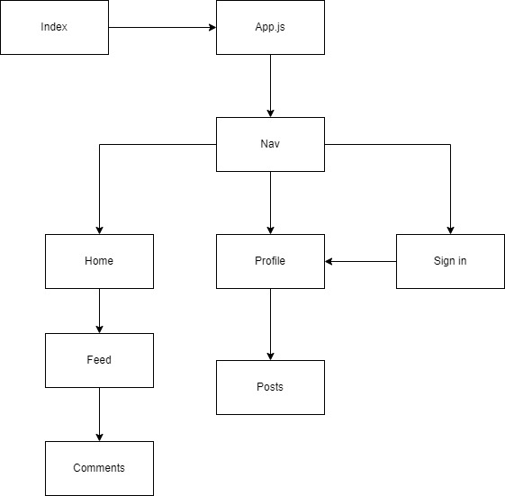
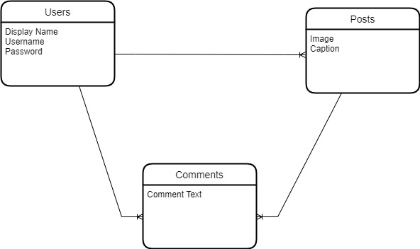

# InstaClone
## Date: 12/8/22
### Developed by:

Mohamed Osman || [github](https://github.com/MohamedOsman15/) | [Linkedin](https://www.linkedin.com/in/mohamed-aosman/)

## Description:
I've always didn't like instagram, every new update they copy a different app instead of making theirs better. Instagram used to be used soley to post pictures but now you have shorts, stories, and marketplace, which wouldn't be a problem if they integrated it properly but it feels like they just jammed it in. So I'm going to make a Clone of Instagram but without the extra fluff.

## Technologies Used:
Pern stack:
* PostgresSQL 
* Express
* React
* Node.js

## Diagrams:

# Links:
[BackEnd](https://github.com/MohamedOsman15/InstaClone_Backend)
